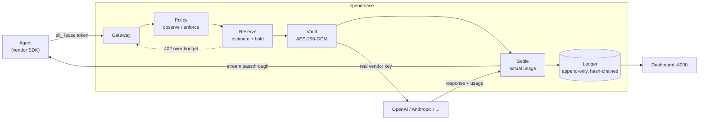

# spendlease

`spendlease` is a self-hosted reverse proxy for OpenAI, Anthropic, Kimi,
DeepSeek, xAI, Gemini, and Z.AI. It keeps
vendor keys out of agent environments, gives each agent a short-lived lease,
checks a budget before forwarding a request, and records calculated token cost
in an append-only ledger.

The useful comparison is IAM rather than expense reporting: a lease says who
may spend, where, for how long, and up to what amount. A retry loop stops when
its run reaches the configured budget instead of continuing until someone
notices the vendor bill.

[](https://github.com/premhiru/spendlease/actions/workflows/ci.yml)
[](LICENSE)
[](https://pkg.go.dev/github.com/premhiru/spendlease)

---

## Quickstart

> [!NOTE]
> The current `main` branch contains the planned v0.1 feature set, but there is
> no stable release yet. The existing `v0.1.0-alpha.1` tag predates several
> features described here. Use `:edge` to evaluate the current container, or
> pin a `sha-...` container tag when you need a repeatable build.

The demo starts a temporary gateway, a mock provider, and three simulated
agents. It does not need a vendor key and deletes its in-memory state when it
stops:

```bash
docker run --rm -p 4000:4000 ghcr.io/premhiru/spendlease:edge \
  demo --target http://0.0.0.0:4000
```

It launches a mock provider and three leased agents, including a runaway retry
loop. Visit the printed dashboard URL to watch spend accumulate, the budget
block requests, and the kill switch revoke the loop's lease. The demo uses an
in-memory database and removes all state when it exits.

To run the demo from source instead:

```bash
go run ./cmd/spendlease demo
```

For a real provider, follow [Getting started](docs/getting-started.md). It
covers the binary and Docker workflows, persistent state, vendor credentials,
leases, and the environment variables used by an application.

## Integration

An application only needs a different base URL and a spendlease lease in place
of its vendor API key. The rest of the vendor SDK remains unchanged.

OpenAI and Anthropic keep their familiar root paths. The other providers use
an explicit prefix such as `/deepseek` or `/gemini` to avoid ambiguous
OpenAI-compatible routes. [Providers](docs/providers.md) lists every base URL
and includes a complete example.

The optional thin SDK packages validate the lease and produce the vendor
client options without wrapping the vendor API:

```python
from openai import OpenAI
from spendlease import Lease

client = OpenAI(**Lease.from_env().openai_kwargs())
```

```typescript
import OpenAI from "openai";
import { Lease } from "@spendlease/sdk";

const client = new OpenAI(Lease.fromEnv().openAIOptions());
```

The SDK packages are currently installed from this repository. You can also
configure the vendor SDK directly:

```python
import os
from openai import OpenAI

client = OpenAI(
    base_url="http://localhost:4000/v1",
    api_key=os.environ["SPENDLEASE_LEASE_TOKEN"],  # sll_...; never your OpenAI key
)
```

```typescript
import Anthropic from "@anthropic-ai/sdk";

const client = new Anthropic({
  baseURL: "http://localhost:4000",
  apiKey: process.env.SPENDLEASE_LEASE_TOKEN,
});
```

Before running the application, store the vendor key, create a run, and issue
a short-lived lease:

```bash
spendlease keys principal create --name checkout-agent
spendlease keys provider set openai --key sk-proj-...
spendlease keys run create --principal checkout-agent --budget 25.00
spendlease keys lease issue --run <run-id> --ttl 15m --providers openai
export SPENDLEASE_LEASE_TOKEN=sll_...
export SPENDLEASE_URL=http://localhost:4000
spendlease serve
```

PowerShell uses `$env:SPENDLEASE_LEASE_TOKEN = "sll_..."` and
`$env:SPENDLEASE_URL = "http://localhost:4000"`. The principal key printed by
the first command is a long-lived bootstrap credential; applications should
use the lease token printed by `keys lease issue`.

Every new principal starts in **observe mode**: everything passes through, nothing is blocked, all of it is recorded. Flip to enforcement when you trust the numbers, with one API call or one toggle in the dashboard.

```bash
spendlease keys principal set-mode --name checkout-agent --mode enforce
```

## What it does

- **Enforces a price-book budget before egress.** Token cost is reserved against a run at request time and settled from reported usage. A reservation that does not fit returns a `402` naming the limiting run and shortfall.
- **Holds your vendor credentials.** AES-256-GCM at rest, keyed by `SPENDLEASE_MASTER_KEY`. The gateway swaps the lease token for the real key at egress.
- **Attributes recorded token cost.** Every ledger entry names its principal, run, provider, and model. Child runs draw from their own budget and every budgeted ancestor.
- **Rejects revoked leases on the next request.** `POST /admin/principals/{id}/revoke` invalidates every lease for that principal against an in-memory revocation set. `spendlease keys revoke --all` provides the same control from the CLI.
- **Keeps a tamper-evident ledger.** Append-only, enforced by a database trigger, with each entry carrying the previous entry's hash.
- **Forwards SSE without response buffering.** Chunks are flushed as they arrive while usage events are observed for settlement.

## What it does not do

- **No reconciliation or ERP export.** It will not close your books or talk to NetSuite.
- **No charts.** The dashboard is one table, sorted by spend descending.
- **No framework integrations.** No LangChain, CrewAI, or LlamaIndex adapters. Base-URL override works everywhere and does not rot.
- **No multi-tenancy, SSO, or RBAC.** Single tenant, self-hosted, one shared admin surface.
- **No anomaly detection or least-cost routing.** It enforces the budget you set; it will not second-guess your model choice.
- **No payment rails.** It authorizes spend against vendor accounts you already have. It does not move money.
- **Not a proxy for correctness.** It counts dollars, not tokens-well-spent.
- **Not a complete vendor-invoice ceiling.** Standard text-token rates, reported cache usage, and documented long-context tiers are modeled. Batch, flex, fast, priority, regional, cache-storage, tool, media, and other non-token charges are not. Validate a workload in observe mode before relying on enforcement.

## How it works



An LLM call has to be authorized before its final token usage is known.
`spendlease` reserves a price-book upper bound, replaces that hold with the
calculated token charge when the response finishes, and releases the
difference. [Reserve and
settle](docs/reserve-and-settle.md) explains the calculation and the behavior
on disconnects and provider errors.

> [!IMPORTANT]
> For OpenAI-compatible streaming endpoints, `spendlease` injects `stream_options: {include_usage: true}` when you have not set it, so it can read actual token counts. The extra usage chunk that produces is withheld from the stream you receive, so what you read is byte-identical to what you would have read without spendlease in the path.
>
> Your request is modified in flight, and the response says so with `X-Spendlease-Stream-Options: injected`. Anthropic requests are never modified — the Messages API reports usage without being asked. Reasoning and rejected alternatives in [ADR-0012](docs/adr/0012-stream-options-injection.md).

### Overhead

Gateway overhead is held under **10ms p99**, excluding upstream provider time,
and CI fails the build if the streaming benchmark exceeds it. The current
steady-state measurement is **0.74ms p99** over 300 in-memory SSE requests on
Windows/amd64 (Intel i7-1065G7); run `go test ./internal/gateway -run
TestStreamingGatewayOverheadP99 -v` to measure the same path locally.

### Pricing data

Costs come from a versioned price book in [`/pricing`](pricing/): plain YAML with effective dates, hot-reloadable, data rather than code.

```yaml
version: 2
effective: 2026-07-31
providers:
  deepseek:
    models:
      deepseek-v4-flash:
        input_per_1m: 0.14
        cached_input_per_1m: 0.0028
        output_per_1m: 0.28
        default_max_tokens: 4096
```

Unknown models never silently cost zero. They log loudly, apply a configurable fallback rate, and mark the ledger entry `estimated: true`.

Vendor prices change often. Price book updates are plain YAML and are a useful
first contribution; see [CONTRIBUTING](CONTRIBUTING.md#price-book-updates).

## Documentation

| | |
|---|---|
| [Getting started](docs/getting-started.md) | Install, first principal, first lease |
| [Providers](docs/providers.md) | Credentials, base URLs, routing, and pricing scope |
| [CLI reference](docs/cli-reference.md) | Commands, flags, environment variables |
| [Dashboard](docs/dashboard.md) | Fields, controls, access, and limitations |
| [Concepts](docs/concepts.md) | Principal, run, lease, reservation |
| [Reserve and settle](docs/reserve-and-settle.md) | The deep explanation, streaming caveat included |
| [Policy reference](docs/policy-reference.md) | Every policy field |
| [Price book](docs/pricing-book.md) | Format, and how to contribute updates |
| [Self-hosting](docs/self-hosting.md) | Persistent deployment, backups, and key management |
| [API reference](docs/api-reference.md) | Admin and gateway HTTP surface |
| [FAQ](docs/faq.md) | |
| [ADRs](docs/adr/) | Why things are the way they are |

Full site: **<https://premhiru.github.io/spendlease>**

## Release status

`main` contains the gateway, encrypted credential vault, SQLite store, price
book, reserve-and-settle enforcement, dashboard, leases, revocation, SDK
helpers, and demo. PostgreSQL, multi-tenancy, and the other items listed above
are not implemented.

The project is still pre-v1. The mutable `edge` container tracks `main`, while
every build also publishes an immutable `sha-...` tag. The tagged
`v0.1.0-alpha.1` release is older than the current feature set; do not use that
tag as a substitute for the current documentation.

## Contributing

[CONTRIBUTING.md](CONTRIBUTING.md) covers local setup, tests, price book
changes, and pull-request conventions. Questions and design discussion belong
in [GitHub Discussions](https://github.com/premhiru/spendlease/discussions).
Report security problems privately as described in [SECURITY.md](SECURITY.md).

## License

[Apache 2.0](LICENSE).
