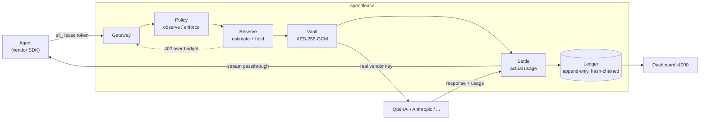

# spendlease

**A spend authorization gateway for AI agents.** It holds your vendor API keys, issues short-lived scoped leases to agents, enforces hard spending caps before a request is allowed out, and records an immutable ledger of every dollar each agent spent.

Agents spend real money on inference, search APIs, data APIs and scrapers, and almost nobody can answer "which agent spent this?" until the invoice arrives. A retry loop with no ceiling will burn $40,000 overnight, and the first signal is a billing alert three days later. `spendlease` puts an authorization decision in front of every one of those calls, so the loop dies at $50 instead.

This is **IAM for machine spend**, closer to `sts:AssumeRole` than to Expensify. It is meant to be load-bearing infrastructure that you install once and never rip out.

[](https://github.com/premhiru/spendlease/actions/workflows/ci.yml)
[](LICENSE)
[](https://pkg.go.dev/github.com/premhiru/spendlease)

---

## Quickstart

No signup, no config file, no database to provision.

```bash
docker run -p 4000:4000 ghcr.io/premhiru/spendlease
```

Open <http://localhost:4000>. The dashboard is live and empty. To fill it without wiring up your own application first:

```bash
docker exec -it $(docker ps -q -f ancestor=ghcr.io/premhiru/spendlease) spendlease demo
```

`spendlease demo` spawns a simulated agent fleet against a mock provider, including one agent deliberately stuck in a retry loop. Watch it climb the table, then hit **Revoke** and watch it stop mid-flight.

Prefer a binary?

```bash
go install github.com/premhiru/spendlease/cmd/spendlease@latest
spendlease serve
```

State lands in a single SQLite file (`./spendlease.db` by default). Point `--store` at a PostgreSQL URL when you outgrow it; the schema is identical.

## Integration

One line. Override the base URL. This works with every vendor SDK in every language, because it is just an HTTP endpoint.

```python
from openai import OpenAI

client = OpenAI(
    base_url="http://localhost:4000/v1",
    api_key=os.environ["SPENDLEASE_LEASE_TOKEN"],  # sll_... , not your OpenAI key
)
```

```typescript
import Anthropic from "@anthropic-ai/sdk";

const client = new Anthropic({
  baseURL: "http://localhost:4000",
  apiKey: process.env.SPENDLEASE_LEASE_TOKEN,
});
```

Your real vendor keys stay in the gateway's encrypted vault. The agent never holds one. To mint a lease:

```bash
spendlease keys principal create --name checkout-agent          # -> slk_...  (shown once)
spendlease keys run create --principal checkout-agent --budget 25.00
spendlease keys lease issue --run <run-id> --ttl 15m --provider openai   # -> sll_...  (shown once)
```

Every new principal starts in **observe mode**: everything passes through, nothing is blocked, all of it is recorded. Flip to enforcement when you trust the numbers, with one API call or one toggle in the dashboard.

```bash
spendlease keys principal set-mode checkout-agent --mode enforce
```

## What it does

- **Caps spend before the request leaves.** Costs are estimated and reserved against a run's budget at request time, then settled against actual usage on completion. Over-budget requests get a `402` naming the run, the cap, and the shortfall.
- **Holds your vendor credentials.** AES-256-GCM at rest, keyed by `SPENDLEASE_MASTER_KEY`. The gateway swaps the lease token for the real key at egress.
- **Attributes every dollar.** Per principal, per run, per model. Sub-agents are runs with a `parent_run_id` drawing from the parent's remaining budget: budget flows down, accountability rolls up.
- **Kills a runaway agent in under a second.** `POST /admin/principals/{id}/revoke` invalidates every lease for that principal against an in-memory revocation set checked on every request. `spendlease keys revoke --all` from the CLI.
- **Keeps a tamper-evident ledger.** Append-only, enforced by a database trigger, with each entry carrying the previous entry's hash.
- **Streams properly.** SSE chunks pass through untouched as they arrive, and usage accumulates as they go. No buffering, no added latency to first token.

## What it does not do

Being clear about this is more useful than a longer feature list:

- **No reconciliation or ERP export.** It will not close your books or talk to NetSuite.
- **No charts.** The dashboard is one table, sorted by spend descending. That is deliberate.
- **No framework integrations.** No LangChain, CrewAI, or LlamaIndex adapters. Base-URL override works everywhere and does not rot.
- **No multi-tenancy, SSO, or RBAC.** Single tenant, self-hosted, one shared admin surface.
- **No anomaly detection or least-cost routing.** It enforces the budget you set; it will not second-guess your model choice.
- **No payment rails.** It authorizes spend against vendor accounts you already have. It does not move money.
- **Not a proxy for correctness.** It counts dollars, not tokens-well-spent.

## How it works



The hard part is that you cannot know an LLM call's cost until it finishes, but you have to authorize it before it starts. `spendlease` handles this like a fuel pump pre-authorization: reserve an upper bound up front, settle the real number afterward, release the difference. See [reserve-and-settle](docs/reserve-and-settle.md) for the full explanation, including what happens on mid-stream disconnects and provider errors.

> [!IMPORTANT]
> For OpenAI-compatible streaming endpoints, `spendlease` injects `stream_options: {include_usage: true}` when you have not set it, so it can read actual token counts. If you did not ask for usage, the extra usage chunk is stripped from the stream you receive. Your request is modified in flight. This is documented rather than hidden, and covered in detail in [reserve-and-settle](docs/reserve-and-settle.md).

### Overhead

Gateway overhead is held under **10ms p99**, excluding upstream provider time, and CI fails the build if the streaming benchmark exceeds it. Measured figures are published here once that benchmark lands.

### Pricing data

Costs come from a versioned price book in [`/pricing`](pricing/): plain YAML with effective dates, hot-reloadable, data rather than code.

```yaml
version: 1
effective: 2026-07-01
providers:
  openai:
    models:
      gpt-4o:
        input_per_1m: 2.50
        output_per_1m: 10.00
        default_max_tokens: 4096
```

Unknown models never silently cost zero. They log loudly, apply a configurable fallback rate, and mark the ledger entry `estimated: true`.

Vendor prices change constantly and nobody else maintains a normalized cost table across every vendor an agent might call. **Price book PRs are the single most valuable contribution to this project** and the easiest place to start. See [CONTRIBUTING](CONTRIBUTING.md#price-book-updates).

## Documentation

| | |
|---|---|
| [Getting started](docs/getting-started.md) | Install, first principal, first lease |
| [Concepts](docs/concepts.md) | Principal, run, lease, reservation |
| [Reserve and settle](docs/reserve-and-settle.md) | The deep explanation, streaming caveat included |
| [Policy reference](docs/policy-reference.md) | Every policy field |
| [Price book](docs/pricing-book.md) | Format, and how to contribute updates |
| [Self-hosting](docs/self-hosting.md) | Production deployment, PostgreSQL, key management |
| [API reference](docs/api-reference.md) | Admin and gateway HTTP surface |
| [FAQ](docs/faq.md) | |
| [ADRs](docs/adr/) | Why things are the way they are |

Full site: **<https://premhiru.github.io/spendlease>**

## Status

Pre-v0.1 and under active construction. The README above describes v0.1 as designed; features land phase by phase and `main` stays working throughout. Check the [milestones](https://github.com/premhiru/spendlease/milestones) for what has actually shipped.

## Contributing

[CONTRIBUTING.md](CONTRIBUTING.md) gets you from clone to green tests in four commands. Bug reports, price book updates, and provider adapters are all welcome. Questions and design discussion belong in [GitHub Discussions](https://github.com/premhiru/spendlease/discussions); security reports follow [SECURITY.md](SECURITY.md) and should never be filed as public issues.

## License

[Apache 2.0](LICENSE). The patent grant is deliberate: this is infrastructure, and adopters should not have to think twice.
