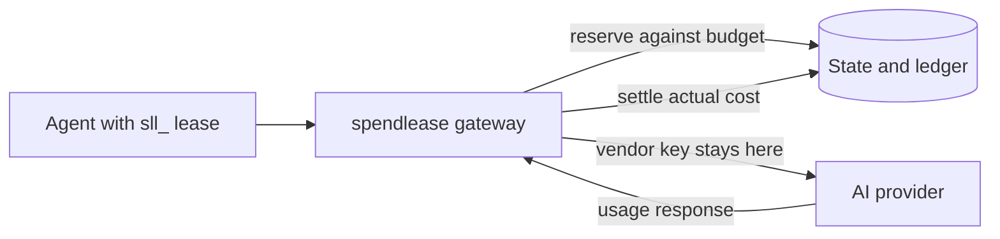

# spendlease

`spendlease` is a self-hosted spend authorization gateway for AI agents. It
keeps vendor keys out of agent environments, issues short-lived credentials,
checks a budget before each request, and records calculated token cost in an
append-only ledger.

[](https://github.com/premhiru/spendlease/actions/workflows/ci.yml)
[](LICENSE)
[](https://pkg.go.dev/github.com/premhiru/spendlease)

> [!IMPORTANT]
> `v0.2.0-beta.2` is the current beta. It is suitable for an end-to-end
> evaluation, not an unqualified production rollout. Pin the release binary,
> container digest, or commit while the API remains pre-v1.

## See the budget guard work

Run a throwaway simulation with no vendor key:

```bash
docker run --rm ghcr.io/premhiru/spendlease:0.2.0-beta.2 demo
```

The demo creates three agents. One retry loop exhausts its budget, receives a
`402`, and then has its lease revoked. The output ends with lines like:

```text
retry-loop: gateway returned 402
KILL SWITCH: revoked 1 lease(s) for retry-loop
retry-loop: gateway returned 401
```

To watch the same simulation in the dashboard, run the release binary on your
host:

```bash
spendlease demo --duration 0
```

From a source checkout, use:

```bash
go run ./cmd/spendlease demo --duration 0
```

Open the printed URL and stop the demo with Ctrl+C. The demo uses a mock
provider and an in-memory database.

[Follow the five-minute quickstart](docs/quickstart.md) or
[send your first request through a real provider](docs/getting-started.md).

## How it fits



Applications keep using the vendor SDK. They change only the base URL and API
key:

```python
import os
from openai import OpenAI

client = OpenAI(
    base_url="http://localhost:4000/v1",
    api_key=os.environ["SPENDLEASE_LEASE_TOKEN"],
)

response = client.chat.completions.create(
    model="gpt-5.4-mini",
    max_completion_tokens=512,
    messages=[{"role": "user", "content": "hello"}],
)
```

The lease identifies the agent and run, limits which providers it may use, and
expires automatically. The real vendor key remains encrypted in spendlease.

## Supported providers

| Provider | Application base URL |
|---|---|
| OpenAI | `http://localhost:4000/v1` |
| Anthropic | `http://localhost:4000` |
| Kimi | `http://localhost:4000/kimi/v1` |
| DeepSeek | `http://localhost:4000/deepseek/v1` |
| xAI | `http://localhost:4000/xai/v1` |
| Gemini | `http://localhost:4000/gemini/v1beta/openai` |
| Z.AI | `http://localhost:4000/zai/api/paas/v4` |

See [Providers](docs/providers.md) for credentials, routing, certification,
and current accounting limits.

## What the beta includes

- Short-lived, provider-scoped leases with optional spend ceilings.
- Hierarchical run budgets with atomic reserve-and-settle enforcement.
- Strict mode that rejects unpriced or unbounded requests before egress.
- Encrypted provider credentials and external master-key sources.
- SQLite for one process and PostgreSQL for multi-instance deployments.
- A tamper-evident, append-only ledger with pricing provenance.
- A local dashboard, named operators, role-based access, and audit records.
- Health, readiness, Prometheus metrics, signed alerts, export, and
  reconciliation tools.
- Python and TypeScript helpers that configure official vendor clients.

## Know the boundary

A spendlease budget covers charges represented by its price book. It does not
model negotiated rates, account-level pricing defaults, persistent cache
storage, batch discounts, provider-hosted tool fees, or media generation.
Strict mode blocks known unsupported request shapes, but it cannot prove what
is configured outside the request.

Start in `observe` mode, compare the ledger with the vendor bill, and enable
enforcement only for a workload whose pricing shape you have validated.

## Documentation

| Goal | Guide |
|---|---|
| Understand the product in five minutes | [Quickstart](docs/quickstart.md) |
| Send a budgeted provider request | [Getting started](docs/getting-started.md) |
| Pick a provider and base URL | [Providers](docs/providers.md) |
| Deploy and operate the gateway | [Production checklist](docs/production-checklist.md) |
| Diagnose a failed request | [Errors](docs/errors.md) |
| Look up commands or endpoints | [CLI](docs/cli-reference.md) · [API](docs/api-reference.md) |
| See what remains before 1.0 | [v1 readiness](docs/v1-readiness.md) |

The complete site is published at
[premhiru.github.io/spendlease](https://premhiru.github.io/spendlease/).

## Development

Go 1.25.12 or later is required.

```bash
go test ./...
python -m pip install -r docs/requirements.txt
python -m mkdocs build --strict
```

Contributions are welcome. Start with [CONTRIBUTING.md](CONTRIBUTING.md), and
read [SECURITY.md](SECURITY.md) before reporting a vulnerability.

Apache-2.0 licensed.
