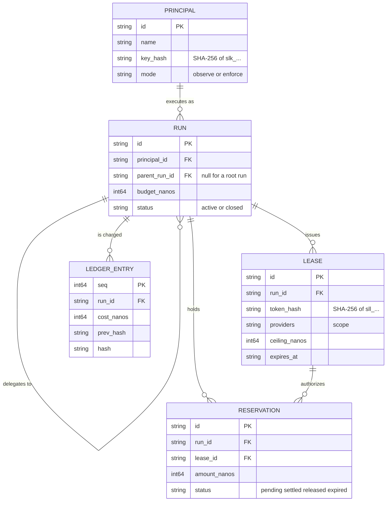

# Concepts

`spendlease` uses four policy objects: principals, runs, leases, and
reservations. Ledger entries record their result.

## Principal

A registered agent or service with a stable identity. Its long-lived key starts
with `slk_`, and its policy determines whether budget overruns are observed or
blocked.

A principal carries a **mode**:

- **`observe`** — everything passes through and nothing is blocked, but all of it is recorded. This is the default for every new principal.
- **`enforce`** — reservations can reject a request.

Observe mode lets an operator compare spendlease's estimates with real
workload behavior before enabling a blocking policy. The dashboard marks
requests that would have exceeded a budget.

## Run

One execution of a principal. A run carries a **budget** and is where money is actually accounted.

Principals are long-lived; runs are not. A principal that handles support tickets might have thousands of runs, one per ticket, each with a $2 budget. That separation is what makes a runaway loop containable — the loop burns one run's budget, not the principal's entire allowance.

A run may have a `parent_run_id`:

- Sub-agents are runs with a parent.
- A child draws from the parent's **remaining** budget, so a parent cannot be over-spent by its children collectively.
- Spend rolls up: a parent's total is its own plus every descendant's.

This makes a parent budget a shared ceiling for all of its descendants while
preserving spend attribution for each child.

## Lease

A short-lived scoped token (`sll_...`) issued against a run. This is what an agent actually holds, in place of a vendor API key.

A lease is scoped three ways:

| Scope | Meaning |
|---|---|
| **Providers** | Which vendors it may reach, such as `openai`, `anthropic`, or `gemini` |
| **Ceiling** | The most this single lease may spend, which may be lower than the run's remaining budget |
| **TTL** | When it stops working, regardless of budget left |

The gateway exchanges the lease token for the stored vendor key immediately
before egress. A leaked lease is limited by its expiry, provider scope, run
budget, optional ceiling, and revocation state.

Revocation is checked against an in-memory set on every request, so revoking a principal invalidates every lease it owns in **under a second**.

## Reservation

A pending hold against a run's budget for an in-flight request.

You cannot know an LLM call's cost until it finishes, but you must authorize it before it starts. A reservation is the fuel-pump pre-authorization that resolves this: hold an upper bound, settle the real number afterward, release the difference. See [reserve and settle](reserve-and-settle.md) for the full mechanism.

Every reservation has a TTL, because a client that disconnects mid-stream would otherwise orphan its hold and permanently shrink the run's budget. A background sweeper reclaims expired ones.

## Ledger

The ledger is the record produced after a reservation settles.

The ledger is **append-only from the first commit**. There is no `UPDATE` path and no `DELETE` path, and that is enforced by a database trigger rather than by convention — application code cannot rewrite history even by accident.

Each entry carries the hash of the entry before it, forming a chain. Changing
any historical entry breaks every hash after it, which makes tampering
detectable rather than merely discouraged.

Hash version 2 also covers exact named usage dimensions, the upstream request
ID when available, and the price-book revision/effective date used for the
charge. Version 1 rows from an older database remain valid and continue to
verify without being rewritten. See [Reconciliation](reconciliation.md) for
comparing a billing period with a normalized vendor statement.

## Money

All amounts are stored as **`int64` nanodollars** — a billionth of a US dollar. No floats, anywhere.

A single `gpt-4o` input token at $2.50 per million costs 2,500
nanodollars. Microdollars would require fractional storage at that rate.
`int64` nanodollars covers approximately ±$9.2 billion.

Binary floating point cannot represent every decimal amount exactly. See
[ADR-0003](adr/0003-money-as-int64-nanodollars.md) for the storage and rounding
decision.

## Identifiers and secrets

Every object has a prefixed, randomly generated identifier — `prn_`, `run_`, `lse_`, `rsv_` — so an ID pasted into a bug report is self-describing.

Secrets are different from identifiers:

- Principal keys are `slk_` followed by 32 random bytes.
- Lease tokens are `sll_` followed by 32 random bytes.
- **Only the SHA-256 hash is stored.** The plaintext is shown once at creation and is not recoverable afterwards — not by an admin, not from the database, not from a backup.

If a key is lost, it is rotated, not recovered.
