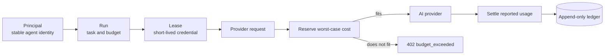

# Control AI spend before it happens

Spendlease is a self-hosted gateway that gives each AI agent a short-lived,
budgeted credential. It checks a worst-case reservation before calling the
provider, then settles the actual token cost into an append-only ledger.

It supports OpenAI, Anthropic, Kimi, DeepSeek, xAI, Gemini, and Z.AI without
wrapping their SDKs. Your application changes the base URL and API key; the
rest of the request stays familiar.

!!! warning "Current maturity"

    `v0.2.0-beta.2` is intended for end-to-end evaluation. It is not a stable
    v1 contract. Pin a release artifact or immutable container digest, begin
    in observe mode, and validate the ledger against your vendor statement.

## Choose your path

| If you want to… | Start here | Time |
|---|---|---:|
| See a budget block with no vendor key | [Run the simulation](quickstart.md) | 5 minutes |
| Send one real, budgeted request | [Getting started](getting-started.md) | 15 minutes |
| Add Kimi, DeepSeek, Gemini, or another provider | [Choose a provider](providers.md) | 10 minutes |
| Deploy beyond a laptop | [Production checklist](production-checklist.md) | Before go-live |
| Fix a failed request | [Errors](errors.md) | As needed |
| Decide what remains before 1.0 | [v1 readiness](v1-readiness.md) | Project planning |

## The authorization model

A principal answers **who** is spending. A run answers **which task** owns the
spend and **how much** it may use. A lease answers **where** it may spend and
**for how long**. A reservation prevents concurrent requests from all seeing
the same remaining balance.

[Read the concepts](concepts.md) or [follow reserve and settle step by
step](reserve-and-settle.md).

## What spendlease protects

- Agents never receive the underlying vendor API key.
- Enforced requests are rejected before egress when their reservation exceeds
  a run, ancestor, or lease ceiling.
- Revocation takes effect immediately and remains durable after restart.
- Ledger rows cannot be updated or deleted through the datastore without
  triggering an integrity failure.
- Operators can identify the principal, run, provider, model, usage, price
  revision, and result behind recorded token spend.

## What it does not promise

The budget covers only charges represented by the active price book. Private
rates, account defaults, batch discounts, persistent cache storage, tool fees,
and media generation may sit outside that model. Strict mode blocks known
unsupported shapes, but a gateway cannot infer settings that never appear in
the request.

Use [observe mode](policy-reference.md#principal-mode) to measure a real
workload before making enforcement part of its availability path.

## Build and operate

- [Dashboard](dashboard.md): create an agent, copy its one-time lease, inspect
  spend, filter events, and revoke access.
- [SDKs](sdks.md): configure Python and TypeScript applications.
- [Policy](policy-reference.md): modes, hierarchical budgets, lease scope,
  ceilings, and reservation settings.
- [Pricing](pricing-book.md): inspect rate provenance and accounting limits.
- [Self-hosting](self-hosting.md): SQLite, PostgreSQL, secrets, TLS, backups,
  monitoring, and upgrades.

## Reference

- [CLI reference](cli-reference.md)
- [Operator and gateway API reference](api-reference.md)
- [Error reference](errors.md)
- [Architecture decision records](adr/README.md)

Contributions are welcome. Price updates are dated YAML changes and do not
require Go code; see the
[contribution guide](https://github.com/premhiru/spendlease/blob/main/CONTRIBUTING.md).
