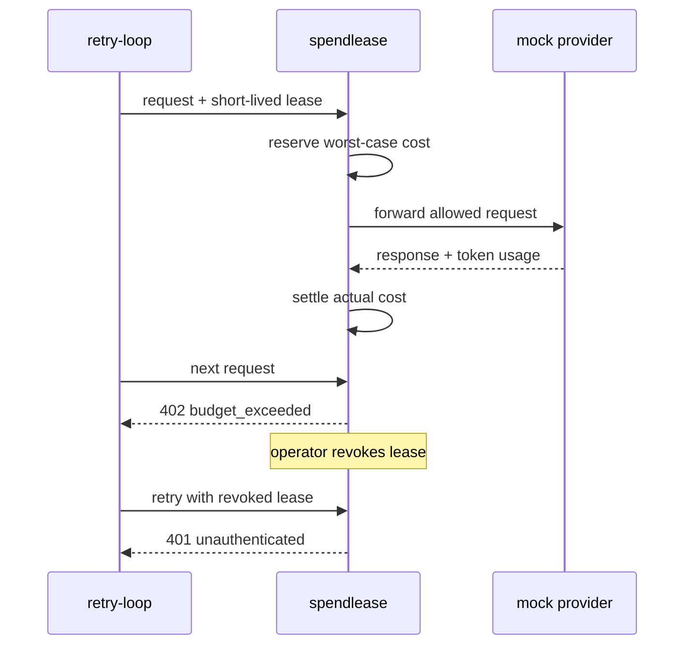

# Quickstart

In five minutes, you will run a disposable spendlease gateway and see an
agent stopped first by its budget and then by a revoked lease. You do not need
an AI provider account or API key.

## Before you begin

Choose one of these paths:

- **Docker:** quickest way to see the authorization decisions in your
  terminal.
- **Release binary or source:** also lets you explore the live dashboard.

The simulation uses a mock provider and keeps its database in memory. It
cannot spend real money and leaves no state behind.

## Run the simulation

### With Docker

```bash
docker run --rm ghcr.io/premhiru/spendlease:0.2.0-beta.2 demo
```

The container does not need a published port for this terminal-only path.

### With the release binary

Download the binary and matching `.sha256` file for your platform from the
[`v0.2.0-beta.2` release](https://github.com/premhiru/spendlease/releases/tag/v0.2.0-beta.2),
verify it, and put `spendlease` on your `PATH`. Then run:

```bash
spendlease demo --duration 0
```

### From source

With Go 1.25.12 or later installed:

```bash
git clone https://github.com/premhiru/spendlease.git
cd spendlease
go run ./cmd/spendlease demo --duration 0
```

## Confirm the result

The demo starts three agents against a local mock provider. `retry-loop` has a
$0.04 cap and tries every 50 milliseconds. Its output should include:

```text
retry-loop: gateway returned 402
KILL SWITCH: revoked 1 lease(s) for retry-loop
retry-loop: gateway returned 401
```

Those lines show two different controls:

1. `402` means the next reservation would exceed the run budget. The provider
   was not called.
2. The kill switch revokes the active lease.
3. `401` means the same credential can no longer authenticate.

When you run the binary or source path, open the dashboard URL printed at
startup. The summary shows each agent's budget and spend. **Recent events**
shows the budget block and lease revocation. Use its agent, result, time, and
ID filters to isolate one run in a busy gateway.

Stop a persistent demo with Ctrl+C. Without `--duration 0`, it stops after 30
seconds.

## What just happened



The real gateway follows the same flow. The differences are that state is
persistent, the encrypted vault holds an actual vendor key, and your
application presents the lease.

## Continue

- [Send your first real provider request](getting-started.md).
- [Learn the four core objects](concepts.md).
- [Review the production checklist](production-checklist.md) before exposing
  the gateway to a real workload.

## Troubleshooting

### The port is already in use

Choose another local port:

```bash
spendlease demo --target http://127.0.0.1:4001 --duration 0
```

### The dashboard disappears

The default demo lasts 30 seconds. Run it again with `--duration 0` and leave
that terminal open.

### Docker does not show a dashboard

The Docker command above is intentionally a terminal demonstration. Docker's
network boundary makes the browser a remote dashboard client, which requires
operator authentication. Use the release binary or source path for the
credential-free local dashboard experience.
